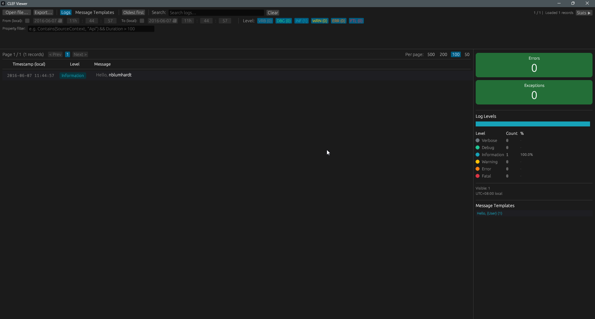

# CLEF Viewer

A fast, portable desktop log viewer for [CLEF](https://clef-json.org/) (Compact Log Event Format) files — the structured JSON log format used by [Serilog](https://serilog.net/) and [Seq](https://datalust.co/seq).

Single executable, no installation required. Built with Rust and [egui](https://github.com/emilk/egui).

## Features

- **Open or drag-and-drop** `.clef`, `.log`, `.json` files
- **Full-text search** across messages, templates, timestamps, exceptions, and raw properties
- **Level filtering** — toggle Verbose, Debug, Info, Warning, Error, Fatal independently
- **Date/time range filter** with local timezone display
- **Property filter expressions** — e.g. `Contains(SourceContext, "Api") && Duration > 100`
- **Message template aggregation** — group logs by template, click to filter
- **Inline detail view** — click any log row to expand and inspect all properties
- **Exception highlighting** with dedicated exception count card
- **Error/Fatal stats** and **Exception stats** cards with one-click filtering
- **Paginated log view** with configurable page size (50 / 100 / 200 / 500)
- **Keyboard shortcuts** — `Ctrl+W` to close the current file
- **Async file loading** — UI stays responsive while loading large files
- **Dark theme** with color-coded log levels

## Screenshot



## Download

Grab the latest `clef-viewer.exe` from the [Releases](../../releases) page. No installation needed — just run it.

## CLEF Format

Each line in a CLEF file is a JSON object with these standard fields:

| Field   | Description                                                                            |
| ------- | -------------------------------------------------------------------------------------- |
| `@t`  | Timestamp (RFC 3339 or naive)                                                          |
| `@l`  | Log level (`Verbose`, `Debug`, `Information`, `Warning`, `Error`, `Fatal`) |
| `@mt` | Message template with `{Property}` placeholders                                      |
| `@m`  | Pre-rendered message (used when `@mt` is absent)                                     |
| `@x`  | Exception / stack trace                                                                |

Example:

```json
{"@t":"2024-03-15T10:30:00.123Z","@l":"Error","@mt":"Failed to process order {OrderId}","OrderId":42,"@x":"System.Exception: ..."}
```

## Build from Source

Requires [Rust](https://rustup.rs/) (stable).

```bash
# Debug build
cargo build

# Release build (optimized, ~5 MB)
cargo build --release
```

The release binary is at `target/release/clef-viewer.exe`.

## Usage

1. Run `clef-viewer.exe`
2. Click **Open file** or drag a `.clef` / `.log` / `.json` file onto the window
3. Use the toolbar to search, filter by level, date range, or property expressions
4. Click any log row to expand its full detail view
5. Switch to the **Message Templates** tab to see aggregated templates
6. `Ctrl+W` to close the current file

## License

MIT
